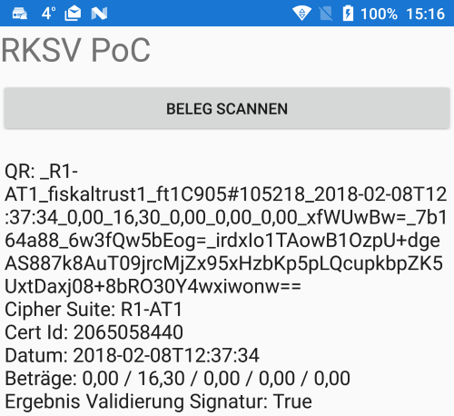

# QR Code Scanner RKVS

Die Idee mit QR und RKSV "herumzuspielen" entstand durch den Talk [BCHGraz - Meetup #16 - Blockchain Real Life Usecases - Dr. Peter Teufl](https://www.slideshare.net/blockchainhubgraz/bchgraz-meetup-16-blockchain-real-life-usecases-peter-teufl), die
Aufzeichnung des Talks findet sich auf [Youtube](https://www.youtube.com/watch?v=enjVlnyjJzU)

Der Proof of Concept funktioniert zu diesem Zeitpunkt mit A-Trust Zertifikaten, siehe Screenshot. 

 
 
Projektstruktur (alle Solutions inkludieren _AT.RKSV.Kassenbeleg.csproj_):

 * __test-parseqrcode-netcore.sln__ .NET Core Unit Tests, somit xplat test- und verwendbar (minimal, wurde verwendet um das API zu erstellen). 
 * __XamBonBon.sln__ Simples PoC UI in Xamarin Forms (.NET Standard 2.0 Projektformat). Bouncy Castle wird verwendet um die Signatur zu validieren, weil GetECDsaPublicKey()
		eine NotImplementedException wirft (nicht weiter nachgeprüft). Dadurch ist auch DER Konvertierung inkludiert, weil Bouncy Castle andere Signaturen schreibt/liest als JWS selbst.
		Details zu den Möglichkeiten des QR Code Scannen weiter unten in einer eigenen Sektion.
 * __AzFuncLdapFacade.sln__ Eine LDAP Abfrage pro Bon (am Phone)? Das skaliert nicht gegen die LDAP Server der VDAs. Deswegen dieser kleine PoC wie man einen datensparsamen
		API Service bauen könnte der die Zertifikatsabfragen cachen kann.

RKSV Links
-------

* https://github.com/BMF-RKSV-Technik/at-registrierkassen-mustercode/releases/download/1.2-DOK/2016-09-05-Detailfragen-RKSV-V1.2.pdf

QR Code Scanning Links
-------

 * http://www.c-sharpcorner.com/article/qr-code-scanner-in-xamarin-forms2/ und https://github.com/Redth/ZXing.Net.Mobile (implementiert)
 * https://github.com/eddydn/XamarinQrCodeCamera (probiert, hatte aber auch AutoFocus Probleme - aber umsetzbar)
 * https://github.com/rebuy-de/rb-forms-barcode (nicht getestet, wäre ein Wrapper um Vision API)

(Android) Apps
-------

 * [EBilly](https://play.google.com/store/apps/details?id=at.weblogic.ebilly) (scheint Validierung durchzuführen)
 * [BMF Belegcheck](https://play.google.com/store/apps/details?id=at.gv.bmf.belegcheck)
 * [RKSV Belegscanner](https://play.google.com/store/apps/details?id=com.jona.rksvbelegscanner)
 * [Belegscanner](https://play.google.com/store/apps/details?id=at.belegscanner.app)
